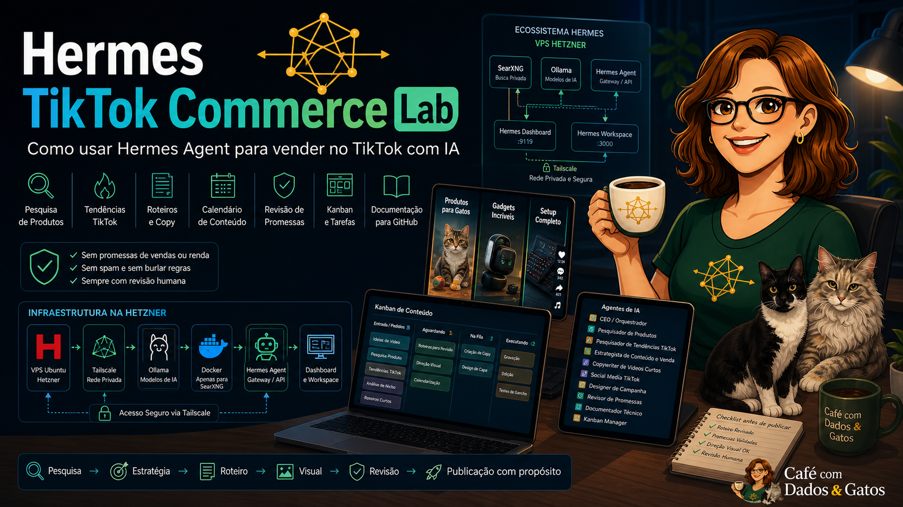
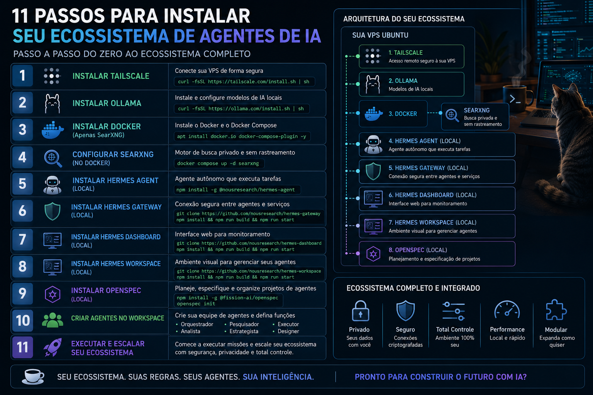

# Hermes Agent na Hetzner

Documentação de instalação do Hermes Agent, Hermes Workspace, OpenSpec, Ollama/Ollama Cloud, SearXNG e ferramentas de apoio em uma VPS Ubuntu da Hetzner.

O foco principal deste material é acompanhar o vídeo de instalação: preparar a VPS, configurar acesso seguro com Tailscale, instalar os serviços necessários e deixar o ambiente pronto para usar agentes de IA.

No final do vídeo, depois da infraestrutura pronta, é criado um projeto inicial TikTok/Shopee apenas como teste prático do fluxo com Hermes, OpenSpec, workers, Kanban, roteiro, prompt visual e revisão humana.

O material não promete vendas, renda, comissão, automação de publicação ou resultado financeiro.



## Para quem é

- Pessoas que querem instalar Hermes Agent em uma VPS Ubuntu da Hetzner.
- Quem quer acessar a VPS com segurança usando Tailscale.
- Quem quer usar Ollama ou Ollama Cloud como apoio aos agentes.
- Quem quer configurar SearXNG como busca local para validação.
- Quem quer usar Hermes Workspace e OpenSpec para organizar agentes antes da execução.
- Criadores que querem acompanhar um passo a passo de copiar e colar.

## O que o projeto faz

- Prepara uma VPS Ubuntu na Hetzner.
- Configura acesso seguro com Tailscale.
- Instala e testa Ollama / Ollama Cloud.
- Usa Docker apenas para SearXNG.
- Instala Hermes Agent sem Docker.
- Configura Hermes Gateway/API.
- Configura Hermes Dashboard.
- Configura Hermes Workspace.
- Usa OpenSpec para organizar o projeto antes da execução.
- Cria workers do Hermes via CLI.
- Usa Kanban como controle operacional.
- No final, cria um projeto inicial TikTok/Shopee para testar o fluxo com agentes, Kanban, roteiro, prompt visual e revisão humana.

## O que o projeto não faz

- Não promete vendas.
- Não promete renda.
- Não promete comissão garantida.
- Não ensina enriquecimento rápido.
- Não ensina spam.
- Não ensina a burlar regras do TikTok, Shopee ou qualquer plataforma.
- Não automatiza publicação sem revisão humana.
- Não cria integração automática com TikTok, Shopee ou PipClip se ela não estiver implementada.
- Não ensina instalação completa do ComfyUI neste momento.

## Capítulos do vídeo

```text
00:01:53 - O que será feito neste vídeo
00:06:58 - Criando o ambiente na VPS
00:09:04 - Configurando o Tailscale
00:16:22 - Instalando e testando o Ollama
00:24:34 - Instalando e configurando o SearXNG
00:30:09 - Instalando o Hermes Agent
00:44:32 - Configurando o Hermes Workspace
01:00:33 - Instalando e preparando o OpenSpec
01:11:11 - Criando o projeto TikTok/Shopee
01:36:24 - Vídeo gerado pelo prompt do Hermes
01:37:18 - Finalização e próximos passos
```

## Arquitetura



```text
VPS Ubuntu Hetzner
|-- Tailscale
|-- Firewall
|-- Ollama / Ollama Cloud
|-- Docker
|   `-- SearXNG
|-- Hermes Agent sem Docker
|-- Hermes Gateway/API
|-- Hermes Dashboard
|-- Hermes Workspace
|-- OpenSpec
|-- Navegador controlado, quando disponível
`-- Workers criados para o laboratório
```

## Portas

| Serviço | Porta | Uso recomendado |
|---|---:|---|
| SSH | `22` | acesso administrativo restrito |
| SearXNG | `8080` | busca local, preferencialmente via Tailscale |
| Hermes Gateway/API | `8642` | API técnica do Hermes |
| Hermes Dashboard | `9119` | painel técnico |
| Hermes Workspace | `3000` | interface visual dos agentes |
| Ollama | `11434` | modelos locais |

## Ordem principal do laboratório

```text
1. Preparar a VPS Ubuntu.
2. Configurar Tailscale.
3. Instalar e testar Ollama.
4. Subir SearXNG com Docker.
5. Instalar Hermes Agent sem Docker.
6. Configurar Gateway, Dashboard e Workspace.
7. Inicializar OpenSpec.
8. Criar workers via CLI e configurar os arquivos SOUL.md.
9. Rodar um teste operacional com Kanban.
10. Revisar resultados e limitações.
```

## Teste inicial do Projeto TikTok/Shopee

No final do vídeo, o Projeto TikTok/Shopee é criado como primeiro teste prático depois da instalação da infraestrutura.

Esse teste inicial inclui:

- pesquisa de produtos ou oportunidades
- validação externa com SearXNG
- organização de candidatos
- escolha humana
- criação de roteiro
- criação de prompt visual para PipClip
- revisão final
- publicação manual fora da automação

Durante a gravação, a infraestrutura na Hetzner funcionou para Hermes Agent, Gateway, Workspace, OpenSpec, workers e Kanban.

Como a VPS estava fora do Brasil, alguns sites brasileiros ou plataformas sociais podem bloquear pesquisa por IP de datacenter, região, login, captcha ou proteção antifraude.

Nesses casos, o fluxo recomendado é o modo humano assistido:

```text
1. Humano acessa a fonte pelo navegador local.
2. Humano coleta link, print, imagem ou dado básico.
3. Worker analisa o material recebido.
4. Kanban registra estado, fonte, limitação e risco.
5. Conteúdo só avança com revisão humana.
```

## Workers usados na gravação

```text
default = CEO / Orquestrador

hermes-pesquisador-tiktok
hermes-validador-searxng
hermes-organizador-produtos
hermes-criador-conteudo
hermes-designer-pipclip
hermes-revisor-final
```

## Materiais de copiar e colar

Para acompanhar do zero, siga os materiais nesta ordem:

- [Instalação Hermes na Hetzner com OpenSpec](materiais/instalacao_hermes_hetzner_com_openspec.md)
- [OpenSpec com Hermes Workspace](materiais/openspec_hermes_workspace_passo_a_passo_copiar_e_colar.md)
- [Criação dos agentes via CLI](materiais/criar_agentes_via_cli.md)
- [Rodando o projeto operacional](materiais/rodando_projeto_operacional.md)
- [Nota pós-gravação sobre VPS fora do Brasil](materiais/nota_pos_gravacao_vps_fora_do_brasil.md)
- [Prompts gerados para teste](materiais/prompts_gerados.md)
- [Ferramentas de criação visual](materiais/ferramentas_criacao_visual.md)

## Documentação organizada

- [Instalação na Hetzner](docs/instalacao_hetzner_sem_docker.md)
- [OpenSpec](docs/openspec.md)
- [Agentes e Kanban](docs/agentes_e_kanban.md)
- [Arquitetura e portas](docs/arquitetura_e_portas.md)
- [Configuração de variáveis de ambiente](docs/configuracao_env.md)
- [Ferramentas de criação visual](docs/ferramentas_criacao_visual.md)
- [Segurança](docs/seguranca.md)
- [Erros e correções](docs/erros_e_correcoes.md)
- [Operação e manutenção](docs/operacao_e_manutencao.md)
- [Systemd e Nginx](docs/systemd_e_nginx.md)
- [Publicação e YouTube](docs/publicacao_youtube.md)

## Ferramentas opcionais de criação visual

- Canva e CapCut para edição manual, legendas, cortes e acabamento.
- PipClip para criação rápida de criativos com IA, quando fizer sentido. Link de afiliada: [pipclip.ai](https://pipclip.ai/?afid=2Z2MW26).
- ComfyUI como opção avançada para quem tem máquina local e GPU adequada.

Essas ferramentas são opcionais e não substituem o Hermes.

## Segurança

- Não publique arquivos `.env` reais.
- Não publique tokens.
- Não publique senhas.
- Não publique IPs reais da VPS ou do Tailscale.
- Não exponha portas públicas sem necessidade.
- Não publique conteúdo sem revisão humana.
- Não use imagem, marca ou pessoa sem autorização.
- Não faça promessas comerciais sem comprovação.
- Não prometa comissão, renda ou resultado financeiro.


