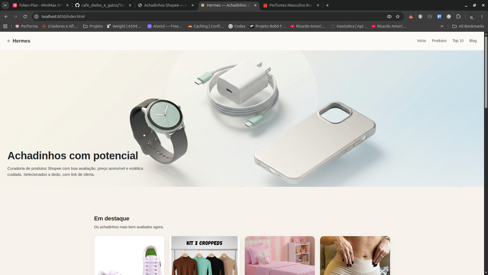
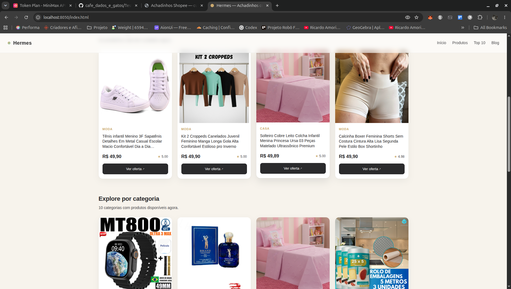
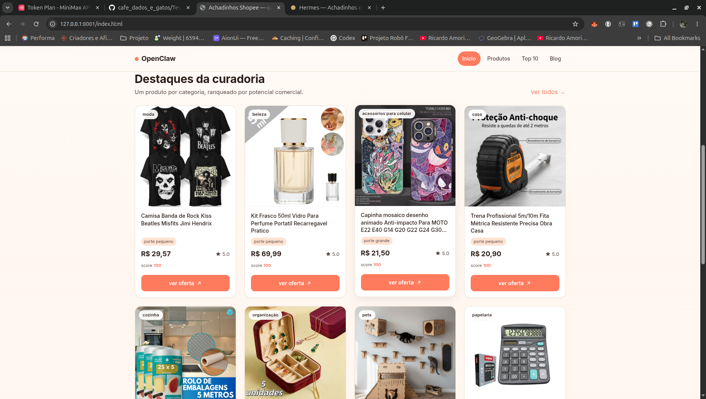
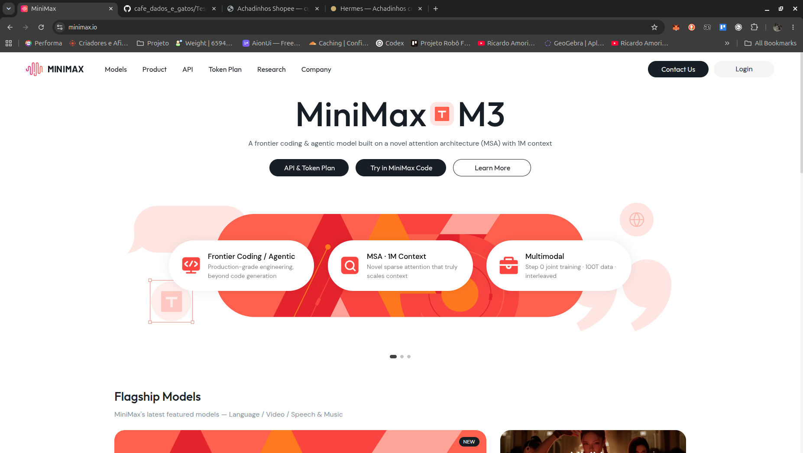

# Teste Minimax M3

Laboratório prático de uso do `MiniMax M3` para transformar dados de produtos da Shopee em um fluxo mais completo de curadoria, promptagem visual e montagem de site/blog comercial.

Este material foi organizado para testar o modelo em tarefas reais de produção, e não apenas em exemplos isolados. O foco aqui é sair de um `CSV` de produtos e chegar a uma estrutura pronta para publicação, com regras editoriais, validações e caminhos diferentes de execução.

## Desconto MiniMax

🚀 **GANHE 12% DE DESCONTO no Plano MiniMax Token Plan:**  
[https://platform.minimax.io/subscribe/coding-plan?code=LSRdjVVKt6&source=link](https://platform.minimax.io/subscribe/coding-plan?code=LSRdjVVKt6&source=link)

Aproveite o preço promocional do MiniMax M2.7 com o cupom do canal Café com Dados e Gatos.

## Links oficiais da plataforma

- MiniMax Cloud Platform: [https://minimax.io](https://minimax.io)
- Documentação Oficial da API: [https://minimax.io/docs/guides/text-generation](https://minimax.io/docs/guides/text-generation)

## Visão geral

Este diretório reúne prompts e checklists para:

- analisar um CSV da Shopee
- selecionar produtos com `potencial comercial estimado`
- organizar arquivos finais para publicação
- gerar prompt de imagem Hero
- gerar prompt de vídeo para ComfyUI
- orientar a montagem de um site/blog de afiliados
- comparar o mesmo fluxo em ambientes diferentes

## O que este teste realmente avalia

Mais do que “usar um modelo”, este conjunto testa se o `MiniMax M3` consegue sustentar uma cadeia de trabalho com começo, meio e fim:

- leitura e filtragem de dados
- aplicação de regras de negócio
- padronização editorial
- preparo de assets textuais
- documentação de saída
- suporte à construção do front-end final

Em outras palavras, esta pasta funciona como um mini pipeline documentado de curadoria comercial assistida por IA.

## Fluxo resumido

```text
CSV Shopee -> Curadoria -> Seleção por potencial comercial estimado -> Prompt Hero -> Prompt de vídeo -> Montagem do site/blog
```

## Trilhas de trabalho

O conteúdo atual está dividido em quatro trilhas:

- `Hermes`
- `OpenClaw`
- `Claude Code`
- `VS Code + Cline`

### Como ler essa divisão

`Hermes` e `OpenClaw` concentram o núcleo da curadoria.

`Claude Code` entra como a trilha principal para montagem final do site.

`VS Code + Cline` foi mantido como alternativa para quem não usa Claude Code.

Isso é importante porque a pasta não está presa a um único ambiente de execução. Ela foi pensada para comparação, reaproveitamento e adaptação do fluxo.

## Estrutura da pasta

```text
Teste Minimax M3/
├── README.md
└── Prompts/
    ├── Claude/
    │   ├── Hermes/
    │   │   └── CLAUDE.md
    │   └── OpenClaw/
    │       └── CLAUDE.md
    ├── hermes/
    │   ├── prompt_hermes_shopee.md
    │   └── prompt_video_comfyui_hermes_shopee.md
    ├── hero/
    │   ├── promtp_hero_Hermes.md
    │   └── promtp_hero_openclaw.md
    ├── openclaw/
    │   ├── prompt_openclaw_shopee.md
    │   └── prompt_video_comfyui_openclaw_shopee.md
    └── VS_Code_Cline/
        ├── criacao_blog_hermes.md
        └── criacao_blog_openclaw.md
```

## Papel de cada área

| Área | Função principal |
|---|---|
| `Prompts/hermes/` | Curadoria de produtos no fluxo Hermes e preparação de prompt de vídeo |
| `Prompts/openclaw/` | Curadoria equivalente no fluxo OpenClaw e preparação de prompt de vídeo |
| `Prompts/hero/` | Criação dos prompts de imagem Hero com base nos produtos finais |
| `Prompts/Claude/` | Checklists de montagem/publicação do site para quem usa Claude Code |
| `Prompts/VS_Code_Cline/` | Alternativa de criação do blog/site para quem prefere VS Code + Cline |

## Arquivos principais para começar

Se você quiser entender rápido o coração do projeto, estes são os melhores pontos de entrada:

- `Prompts/hermes/prompt_hermes_shopee.md`
- `Prompts/openclaw/prompt_openclaw_shopee.md`
- `Prompts/hero/promtp_hero_Hermes.md`
- `Prompts/hero/promtp_hero_openclaw.md`
- `Prompts/Claude/Hermes/CLAUDE.md`
- `Prompts/Claude/OpenClaw/CLAUDE.md`
- `Prompts/VS_Code_Cline/criacao_blog_hermes.md`
- `Prompts/VS_Code_Cline/criacao_blog_openclaw.md`

## O que existe em cada trilha

### `Hermes`

No fluxo `Hermes`, a curadoria é orientada para:

- ler o CSV com `Python/Pandas`
- contar produtos de forma auditável por `itemid`
- filtrar por faixa de preço, nota e disponibilidade de link
- classificar produtos em categorias finais do site
- gerar arquivos prontos para uso
- registrar logs e validações da execução

O prompt também deixa explícito o uso do agente `Frank` e o compromisso com uma curadoria simples, auditável e sem promessas de venda real.

### `OpenClaw`

O fluxo `OpenClaw` replica a mesma lógica metodológica, mudando o ambiente de execução.

Aqui o objetivo é permitir comparação entre orquestrações diferentes sem perder:

- critérios de curadoria
- estrutura de saída
- limites por categoria
- cuidado com links
- padrão editorial

### `Hero`

Os prompts da pasta `hero/` usam os produtos finais como referência para construir uma imagem Hero com cara de:

- blog de achadinhos
- vitrine comercial elegante
- layout limpo e moderno
- apresentação leve, visualmente confiável e publicável

### `Claude Code`

Os arquivos em `Prompts/Claude/` funcionam como checklists mais diretos para a etapa de site.

Eles orientam:

- pasta base do projeto
- pasta exata de saída
- arquivos de entrada prioritários
- regras de publicação
- validação do que pode ou não aparecer no site

Hoje, esta é a trilha mais direta para transformar a curadoria em um site final.

### `VS Code + Cline`

Esta trilha foi mantida para quem quer reproduzir o mesmo tipo de construção usando `Cline` no `VS Code`.

Ela orienta a criação de um blog com:

- Home
- Produtos
- Blog
- página oculta de anúncios copiáveis

Ou seja: não substitui a lógica da curadoria, mas oferece um caminho alternativo para a camada final de interface.

## Regras metodológicas centrais

Um dos diferenciais deste teste é que ele não tenta vender uma narrativa inflada sobre os produtos.

Os prompts insistem em algumas regras importantes:

- usar a expressão `potencial comercial estimado`
- não tratar produtos como `mais vendidos`
- não afirmar venda comprovada
- não prometer comissão garantida
- não sugerir sucesso garantido

Esse cuidado torna o experimento mais sólido do ponto de vista editorial e mais reaproveitável para projetos reais.

## Regras recorrentes nos prompts

Ao longo dos arquivos, aparecem decisões consistentes que ajudam a manter a curadoria auditável:

- usar `product_link` como link principal
- não usar `product_short link` como link oficial do site
- definir `categoria_final` somente por `global_category1` e `global_category2`
- não criar mapeamento manual arbitrário
- usar `description` apenas como apoio para `porte_estimado`
- limitar os arquivos finais a até `4 produtos por categoria`
- gerar logs e validações de execução

## Saídas esperadas do fluxo

Dependendo da trilha usada, o processo foi pensado para chegar em entregáveis como:

- arquivos finais em `CSV` e `JSON`
- lista de links manuais da Shopee
- prompts de imagem Hero
- prompts de vídeo para ComfyUI
- checklist de build para site/blog
- estrutura de publicação com páginas como Home, Produtos e Blog

## Leitura recomendada

Se você quiser seguir a lógica do processo de ponta a ponta, esta sequência funciona bem:

1. Curadoria em `Hermes` ou `OpenClaw`
2. Prompt de imagem Hero
3. Prompt de vídeo
4. Checklist de montagem com `Claude Code`
5. Alternativa de build com `VS Code + Cline`

## Para quem esta pasta é útil

Este material pode ser útil para quem quer:

- testar o `MiniMax M3` fora de exemplos genéricos
- comparar fluxos entre ambientes diferentes
- montar um pipeline de curadoria assistida por IA
- transformar dados em base editorial/comercial
- estruturar um site/blog a partir da curadoria

## Resultado prático deste laboratório

Hoje, esta pasta funciona como:

- acervo de prompts reutilizáveis
- documentação de fluxo
- base de comparação entre ambientes
- referência metodológica para curadoria de produtos
- ponte entre dados, assets e interface final

## Resultados visuais

Este fluxo foi pensado para apoiar saídas como:

- home de blog com cara comercial
- vitrine de produtos por categoria
- cards com imagem, preço, nota e CTA
- páginas de blog com visual publicável
- estrutura mais próxima de projeto real do que de protótipo técnico

### Home do fluxo Hermes



### Vitrine de produtos no Hermes



### Vitrine de produtos no OpenClaw



### Referência do MiniMax M3



## Resumo

Esta pasta representa um experimento aplicado de `MiniMax M3` para:

- curadoria de produtos
- produção de prompts
- preparação de assets
- construção de site/blog
- comparação entre ambientes

Mais do que um teste isolado, este diretório documenta um fluxo reproduzível de trabalho com foco em publicação.
